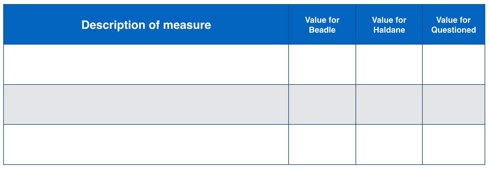

# Homework 2: Forensic Linguistics

**Due**: February 16, 2016

  
### Problem 1 (30 points)

Two paragraphs are given below, one for each of two authors, John Beadle and John Haldane, from texts about traveling in North America. Your job is to determine who wrote the questioned paragraph based on properties of the known paragraph, providing explicit justification for your choices, similarly to what we did in class and which you can see in the first few pages of [the Forensic Linguistics slides]({{site.baseurl}}/public/slides/LNC-ForensicLinguistics.pdf).

#### Text 1, Author: John Beadle

> From Corsicana the train on the Texas Central Railroad carried me early straight south, leaving the valley of the Trinity and bearing across the high country to the Brazos. Not one acre in ten of this region is under fence. All the rest is common pasture, though most of it belongs to private owners, and is for sale at two to six dollars per acre. The region is high and gently undulating, about one-fifth in timber, the rest fertile prairie. My next stopping place was Houston, which I thought, at first view, the most beautiful place in Texas. There had been a twenty-four-hours' rain, and at 9 A. M the sun shone out clear; the orange groves, magnolias, and shade trees looked their richest green and Houston presented to the newly arrived Northerner a most enchanting appearance. That city, the original capital of Texas, is at the head of Buffalo Bayou, a long projection of Galveston Bay.

#### Text 2, Author: John Haldane

> What about Chicago? My dear good friend, what can I say about that ninth wonder of the world which people everywhere do not know already, and yet, something fresh may be squeezed out of it at a few points. I found that it had a population of fully 2,000,000, and was so immense in area, that once in it, you required some time to get out of it, even by rail, or by swift tram cars, two of which ran me one evening nearly twenty miles into the suburbs at a speed of thirty miles an hour when possible. The country round about is flat and uninteresting, but nevertheless, Chicago is a wonderful city throughout, and of unique interest amongst the great cities of the globe. The streets were as crowded as those of London, and the shops quite as handsome, but I could not admire such an array of gigantic commercial buildings, hundreds of feet in height, so much alike, so slabby in form, and flat roofed in most cases.

#### Text 3, Questioned Paragraph

> One week sufficed to conclude my business in Oregon, but before leaving a few general notes are in order. Portland is on the west bank of the Willamette, twelve miles above its mouth and near the head of tide-water. But the Columbia often rises so as to cause backwater, giving the Willamette a variation of thirty-two feet. Ocean steamers load at the wharf, and the place has direct water communication with all the ports of the world, the chief exports being wheat, lumber, beef and salmon. All the older portion of the city is very beautifully improved; elegant residences abound, with many evidences of taste and wealth. The location is picturesque. The Cascade Range is only occasionally visible, but Mount Hood rears its snowy summit sixty miles eastward, and looks as if it were just out of town. Mount Saint Helens is sometimes in good view, though eighty miles to the north-east. All the hills around the city are covered with heavy timber, and in town every street is double lined with shade trees.

For this problem, you must provide three *quantified* measures of authorship style (e.g., average sentence length) and three *non-quantified* observations of similarity (e.g., content or particular expressions). For each measure, you should give its value for each text and you should explicitly state why it supports your determination of who wrote the questioned paragraph. You will be graded on the evidence and reasoning you use, not on whether you get the right author.

#### Part A [15 pts]

Provide three quantified measures (be sure to provide quantities for all three paragraphs). Here is a suggested format for writing the values. Don't forget that you also need to explain how it supports your analysis.

  

#### Part B [15 pts]

Provide three non-quantified measures (state explicitly how each one relates to each paragraph, and how it supports your analysis).

### Problem 2 (30 points)

In [the course slides]({{site.baseurl}}/public/slides/LNC-ForensicLinguistics.pdf) the relative frequency of the words I and the were calculated for five texts of three authors: Austen, Doyle, and Krugman. These two dimensions were used to calculate the centroids for the three authors using the K-means algorithm. There are many other values that could be used for clustering with K-means; for this problem, you'll work with the relative frequency of *we*, *he*, and *a*. In particular, you are given the measurements for six texts, some of them by Austen and some by Doyle, and your job is to cluster them with *k*-means.

Here are the documents and their measurements:

| Doc ID	| x | y	| z |
| ---: | ---: | ---: | ---: |
| d1	| 2.1	| 10.9 | 15.8 | 
| d2	| 4.6	| 11.3 | 23.0 |
| d3	| 1.8	| 11.4 | 19.2 |
| d4	| 1.7	| 9.2	 | 17.1 |
| d5	| 2.1	| 9.5	 | 19.2 |
| d6	| 7.8	| 15.4 | 22.0 |
  
You can probably spot the clusters pretty easily just by inspecting the values, but for this problem you need to compute the centroids of each cluster using K-means.

You are given the following two initial centroids:

| Centroid ID	| x	| y	| z |
| ---: | ---: | ---: | ---: |
| c1	 | 1.8	| 10.0 | 16.4 |
| c2	 | 2.0	| 10.6 | 19.0 |

  
Note that in the slides, we used two of the document points as initial centroids; here, they are different points, so there will be non-zero distances from them to all documents.

#### Part A (5 points)

For every document, compute the distance between it and the two centroids c1 and c2.

In the slides you saw how to compute the squared distance in two dimensions. For three it is not different: you just need to include the z dimensions in your calculation:

Here's a table to help organize your values:

|        | d1	 | d2	 | d3	 | d4	 | d5	| d6  |
| :---:  | --- | --- | --- | --- | --- |  --- | 
| **c1** |     |     |     |     |     |     |
| **c2** |     |     |     |     |     |     |

#### Part B (5 points)

Based on the distances, write down the group memberships for each centroid. Then, compute the new centroids based on the group memberships.

#### Part C (10 points)

Do this for two more iterations (the centroids won't change after that). At each iteration, give the distances, the centroids, and the group memberships.

#### Part D (10 points)

You are given a new document, d7, with the measurements (3.2, 13.3, 24.9) and are told it is written by Doyle. Calculate the distance between d7 and the final centroids you computed for Part C. (Show your work.) Based on this result, which of the first six documents were likely to have been written by Doyle and and which by Austen?

### Problem 3 (25 points)

The [Book of Mormon](http://en.wikipedia.org/wiki/Book_of_Mormon) is a sacred text of the Latter Day Saints that was originally published in 1830 by [Joseph Smith](http://en.wikipedia.org/wiki/Joseph_Smith) (1805-1844). Smith claimed that he was guided by an angel to a set of golden plates on which were inscribed a history of ancient American civilizations in a language Smith referred to as [Reformed Egyptian](http://en.wikipedia.org/wiki/Joseph_Smith). The Book of Mormon itself is Smith's claimed translation from the plates into English. Eleven other individuals signed affidavits asserting that they had witnessed the golden plates; other than this, the plates have never been seen. The only possible example of writing from them is the [Anton transcript](http://en.wikipedia.org/wiki/Joseph_Smith).

The first edition of the Book of Mormon itself was created as a collaboration of Joseph Smith with several scribes, including [Oliver Cowdery](http://en.wikipedia.org/wiki/Oliver_Cowdery). However, some maintain that Sidney Ridgon was the main architect of the text and that he pulled a great deal of material from writings of [Solomon Spalding](http://en.wikipedia.org/wiki/Solomon_Spalding) (1761-1816); this is known as the [Spalding-Rigdon theory](http://en.wikipedia.org/wiki/Spalding-Rigdon_theory_of_Book_of_Mormon_authorship) of Book of Mormon authorship.

This problem involves reading several materials related to the authorship question of the Book of Mormon and answering questions about the design and methodology of authorship studies. The focus is thus less on the conclusions reached, but more on the methodology used.

Read the questions below now, but before answering them, read the following:

- A portion of the first chapter of the [first book of Nephi](http://en.wikisource.org/wiki/Book_of_Mormon/1_Nephi) from the Book of Mormon to get a sense of the language used in the book.
- Jockers et al (2008), a recent paper that uses computational stylistic analysis, the results of which support the Spalding-Rigdon theory. Read (at least) the abstract, background, methodology (first two paragraphs), and conclusion.
  - Jockers, Matthew L., Daniela M. Witten, and Craig S. Criddle. "[Reassessing Authorship of the Book of Mormon Using Delta and Nearest Shrunken Centroid Classification](http://www.matthewjockers.net/wp-content/uploads/2012/09/LLCPreprintReassess1.pdf)." Literary and Linguistic Computing, 2008
- "Morman Heretic", [Rebuttal to Jockers](http://www.wheatandtares.org/2011/02/21/rebuttal-to-jockers/). Blog post, 21 Feb 2011. A brief blog post that critically discusses the Jockers et al article and summarizes a paper by [Schaalje et al (2011)](http://llc.oxfordjournals.org/content/early/2011/01/18/llc.fqq029.abstract) that responds to the Jockers article. (Mormon Heretic has a longer post, [Debunking the Jockers Study](http://www.mormonheretic.org/2011/02/09/debunking-the-jockers-study/), which you can check out if you are interested.)

**Questions** (5 points each)

1. Jockers et al criticize the work by Larsen et al (1980) and Hilton (1988). Briefly explain two of their criticisms (1-2 paragraphs each).
2. Why do Jockers et al. exclude John Smith as a possible author in their study? Do you think they are justified in doing so?
3. Why are Henry Wordsworth Longfellow and Joel Barlow included as possible authors in the Jockers et al study? (Say both why they are included in the study and why it wasn't some other author, say Ben Franklin or Neil Gaiman.)
4. Jockers et al narrow down the possible set of words they could use to just 110 word features. Why did they make sure that each word was seen at least once with each author? Why did they exclude "god", "ye", "thy" and "behold"?
5. In three to four paragraphs, give your thoughts on the methodology used by Jockers et al and whether you think it was valid or whether there are problems with it. It's fine to use just the materials given above, but you are welcome to use other sources. For example, Jockers has a more recent article that supports the exclusion of Smith as a possible author:
  - Jockers, Matthew L. "[Testing Authorship in the Personal Writings of Joseph Smith Using NSC Classification](http://www.matthewjockers.net/wp-content/uploads/2012/09/SmithAnalysisRevised-9-12.pdf)." *Literary and Linguistic Computing*. 28.3, (2013): 371-381.

### Problem 4 (15 points)

The use of machine learning for authorship attribution has typically been applied to small datasets with few possible authors, such as studies about the Federalist Papers and the Book of Mormon studies discussed in the previous problem. However, there is a lot of recent work on deanonymization on the internet based on various types of information associated with our individual actions and profiles. Arvind Narayan (a graduate of UT Austin) worked on [deanonymization of the Netflix challenge dataset](http://www.wired.com/politics/security/commentary/securitymatters/2007/12/securitymatters_1213), showing that some people could be identified based on their movie preferences when cross-compared with IMDb users. He and other colleagues recently published a paper that shows, for the first time, that large-scale authorship attribution is feasible (in their case, testing with 100,000 authors) and accurate enough to be useful in authorship attribution use cases. For example, in their experiments, in 35% of their test cases, the correct author is in the top 20 authors predicted by their model. Given that this is out of 100,000 authors, that is quite significant. 

With that background, read Narayan's blog post about the paper:

- Arvind Narayan: [Is writing style sufficient to deanonymize material posted online?](http://33bits.org/2012/02/20/is-writing-style-sufficient-to-deanonymize-material-posted-online/) Blog post, 20 Feb 2012.
  
Based on that, answer the following questions in 2-3 paragraphs each (5 points each).

1. Briefly discuss some differences between this study and the Jockers et al study. As one thing to consider, do you think there is anything done in one of the studies that would be interesting to consider or valuable in the other context?
2. Why is confidence estimation (how confident the classifier is in its assignments) an important aspect of the work?
3. Discuss the impacts you see coming from work like this. Do you think it is possible for people to change their behavior to mask their stylistic profile? Does it worry you? Consider the world in general, for example the use of social media in the Arab uprisings and censorship in China.