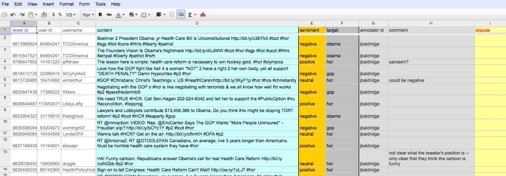
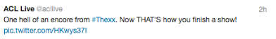
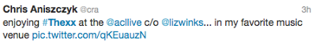
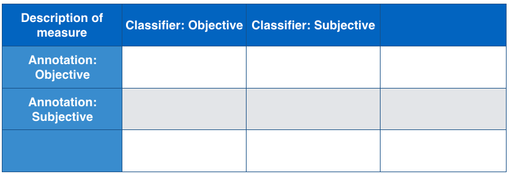
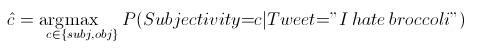
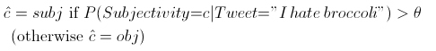

# Homework 3: Classification

**Due**: February 25, 2016

  
### Problem 1 (30 points)

Services like Twitter allow short, real-time commentary about whatever users feel like talking about, and this type of commentary is creating data of great interest for sentiment analysis. Often, there is interest in automatically determining whether a given tweet is positive, negative or neutral toward a specific topic, person, company, etc. For this problem, you will be working with tweets about health care reform that were collected at the time the US Congress was debating and voting on new health care legislation.

***Note: to do this problem, you must open one of the Google spreadsheets that was shared with you as links on Canvas. You may work with any of them while doing this problem. They are:***

 - HCR Tweets - Set1
 - HCR Tweets - Set2
 - HCR Tweets - Set3

**Important**: if for some reason you cannot access any of these, contact the instructor or the TA.

#### Part A [10 pts]

Annotate 10 tweets on the spreadsheet you've chosen (please work with only one of the spreadsheets). You'll find that the Set3 has the most remaining (unannotated) tweets, so that's a good one to go to first.

Follow the directions carefully!

**IMPORTANT: DO NOT RESORT THE SPREADSHEETS!!!!!!!**

**Step 1**. ***Open the spreadsheet.***

You should see something like this:

  

There are 1500 tweets, with one tweet per row of the spreadsheet. Each tweet has the following basic attributes:
  
 - **tweet id**: the unique identification number for the tweet
 - **user id**: the unique identification number for the user who created the tweet
 - **username**: the user's twitter username
 - **content**: the text of the tweet

Your job is to fill in the rest of the annotated attributes for 10 tweets, similarly to what the instructor (Jason Baldridge) did for the first thirty tweets in the list. Also, you'll see annotations from many others -- these include students of past classes and PhD students at UT Austin. 

The attributes are:
  
 - **sentiment**: the sentiment label for the tweet
 - **target**: what subject is the sentiment being expressed about
 - **annotator id**: the identifier for the annotator 
 - **comment**: a place to write down any comments you have about the tweet or the annotation (see the examples above)
 - **dispute**: if someone sees an annotation that they disagree with, they can note it in this column
  
What to do for each of these attributes will be described in detail below. Note that there are actually three groups of these attributes for each tweet. That is to allow one to have multiple targets per tweet. For example, consider the tweet:
  
 - RT @HealthReformNow: As the President said to Republicans, #YouHad10Yrs. See what you'll get with #hcr immediately http://go.usa.gov/lFe

This is positive for the target "hcr" (health care reform) and negative for the target "gop" (Republicans).

**Step 2**. ***Choose an annotator id.***

Your annotator id can be the first letter of your first name followed by your last name (for example, the id for "Jason Baldridge" is "jbaldridge"). You can also use something else (e.g. wolverine, kingtut), provided it isn't the same as any other ids already being used. We will use this to find the tweets you annotated when considering your answers to the other parts of this question. In your submission for this part of the problem, write down what your annotator id is.
 
Step 3. ***Claim 10 tweets by putting your annotator id next to them.***

Before actually annotating any of the tweets, you must "claim" 10 of them by putting your annotator id in the "annotator id" column for the tweets. This will make sure that no one else who is editing the document at the same time will accidentally write over one of your annotations. Note that you can of course be annotating a new target in a tweet that already has one or two targets annotated (three is the maximum number of targets for a tweet on these spreadsheets).

**Step 4**. ***Annotate each of the 10 tweets.***

For each tweet, read the text and decide what sentiment it expresses and what that sentiment is being expressed about. 

The possible values for sentiment are:
  
 - **positive**: the tweet expresses positive polarity toward the target (e.g. "I love health care reform!!!)
 - **negative**: the tweet expresses negative polarity toward the target (e.g. "I hate health care reform!!!)
 - **neutral**: the tweet is objective and does not express polarity toward the target (e.g. "Congress is debating health care reform.") 
 - **unsure**: you simply can't figure out whether it is subjective or objective, or whether it is positive or negative (e.g., it looks sarcastic, but you aren't sure, maybe something like "Health reform is just great.")
 - **irrelevant**: the tweet isn't about health care reform (this should be rare, but does happen some times: e.g. "The Cubanization of Venezuela-Castro works to keep Chavez in power #hcr")  

Sometimes it might be hard to make an exact determination, so it is fine to use the label "unsure" if you can't decide.

The possible values for target are:
  
 - **obama**: Barack Obama
 - **hcr**: heath care reform
 - **gop**: the Republican party (Grand Old Party)
 - **dems**: the Democratic party
 - **teaparty**: the Tea Party
 - **conservatives**: individuals who subscribe to American conservatism
 - **liberals**: individuals who subscribe to American liberalism
 - **stupak**: Bart Stupak
 - **other**: the target is not adequately described by any of the above (use this if the tweet was irrelevant)

Choose the appropriate values for sentiment and target from the drop down menus available with each one (the dropdown menus currently only work for the first target for a tweet). If it is appropriate, you are welcome to add comments in the comments column for the tweet.

A few tips and comments:
  
 - Find out what hashtags like #hcr mean on [tagdef.com]().
 - There may be others editing at the same time. Make sure not to edit a row that someone has already claimed.
 - Make sure you only edit the sentiment, target, annotator id, and comment cells. Don't rearrange the rows or columns. If you accidentally do this, please get in touch with the instructor and TA right away so we can restore the spreadsheet.
 - As an indicator of how long it should take you, Jason annotated 30 tweets in a little under 10 minutes.
 - You are welcome to annotate more than 10 tweets if you would like to do so!
 - If you have any trouble with the spreadsheet, don't hesitate to get in touch with the instructor and the TA.
 - If you have any questions about the annotation, the labels, or are generally unsure about what to do, again, don't hesitate to contact the instructor and the TA!
  
**Part B** [3 pts] 

Calculate the probability of positive out of the positive and negative tweets in your 10 tweets.

**Part C** [5 pts] 

Calculate the probability of positive for tweets about health care reform (target=hcr) from your 10 tweets plus the first 30 tweets annotated by ***jbaldridge*** in HCR Tweets - Set3 (these start at row 96). As in part B, calculate the probability based only on positive and negative tweets (about hcr).

**Part D** [6 pts] 

Name the three most difficult tweets you had to annotate and describe what made them difficult. Try to identify things like polarity flipping, use of discourse markers, sarcasm, etc. that were discussed in the slides.

**Part E** [6 pts] 

Look at tweets that were annotated by others (this can include ***jbaldridge***) and see if you disagree with the annotation of either the sentiment or the target of any of these (including any "unsure" annotations). If you do disagree, make a note in the dispute cell for the tweet on the spreadsheet. In your homework, describe the tweet and how you would annotate it differently and what information you think is necessary to use. For example, is it necessary to know whether a hashtag corresponds to a particular position, like [#handsoff](https://tagdef.com/handsoff) (against health care reform) and [#p2](https://tagdef.com/p2) (for health care reform), or to read the content of a page that the tweeter linked to?

If you agree with all the annotations, you can instead write down any general problems you think there are with annotating tweets in this way. For example, are there any important target values missing, or are many tweets just too short for you to make a determination?

### Problem 2 (30 points)

The band ***The xx*** has asked you to build a system that monitors Twitter during their concerts in Austin and classify tweets as positive or negative about the band. Here are some examples:

  
  

Using Bayes rule, you will compute the probability that the second tweet is positive based on the fact that it contains favorite and based on the following training data:
  
 - **Dataset 1**: You collect 1000 tweets about ***The xx*** and label each of them as positive or negative, finding that 750 of them are positive. The word ***favorite*** is in 70 positive tweets and 4 negative ones. Use this to compute the probability of ***favorite*** given positive and and the probability of ***favorite*** given negative.
 - **Dataset 2**: You ask 200 people at ***The xx*** concert whether they would rate the show positively or negatively, and 185 of them respond positively. Use this to compute the probability of positive and the probability of negative.
  
In answering the questions below, be sure to use dataset 1 and dataset 2 appropriately for computing the probabilities, as indicated above.

 1. [2 pts] What is the probability of negative?  (Show your work). 
 1. [3 pts] What is the probability of ***favorite*** given negative? (Show your work) 
 1. [15 pts] What is the probability of positive given ***favorite***? (Show your work)
 1. [10 pts]  You realize it might be a good idea to use both (a) the positive and negative tweets and (b) the response of the positive and negative concert-goers to get a better estimate. What is the probability of **negative** given ***favorite*** if you use the tweets in addition to the data from the concert-goers to compute the prior probabilities of positive and negative? Hint: you need to add the counts from both groups for positive and negative responses (including both tweet responses and survey responses). (Show your work)

### Problem 3 (25 points)

In a dataset of tweets annotated for polarity, there were 155 tweets annotated as neutral, 167 as positive, and 242 as negative.

I create a subjectivity classifier that identifies tweets as objective (neutral) or subjective (either positive or negative). It labels 153 tweets as objective and the rest as subjective.  Of the 153, only 112 were actually objective. 

#### Part A [7 points]

Fill in the following table based on the data given above

  

#### Part B [9 points]

Now, answer the following questions about the classifier's ability to identify objective tweets.

 1. [1 pt] How many false negatives did the classifier produce as a detector of objective tweets? 
 1. [4 pts] What is the precision of the classifier as a detector of objective tweets? 
 1. [4 pts] What is the recall of the classifier as a detector of objective tweets?

#### Part C [9 points]

Next, answer the following questions about the classifier's ability to identify subjective tweets.

 1. [1 pt] How many false positives did the classifier produce as a detector of subjective tweets?
 1. [4 pts] What is the precision of the classifier as a detector of subjective tweets?
 1. [4 pts] What is the recall of the classifier as a detector of subjective tweets?

### Problem 4 (15 points)

The goal of a subjectivity classifier is to identify tweets that should be labeled as positive or negative by a polarity classifier. The polarity classifier is what will be used to understand the overall positivity or negativity toward health care reform on new tweets, and it will be used to present positive and negative examples to policy makers. Recall that probabilistic classifiers provide not only a label, but also a confidence value (the probability), and that probability can be used as a threshold. For example, rather than saying that the best candidate label is:

  

You can instead choose the label based on a threshold:

  

where θ is a threshold value between 0 and 1. If θ = 0.5, then the decision is the same as the argmax above, but if θ =0.8, then we are saying that we will only consider tweets subjective if they have a probability of being subjective greater than .8, and so on. This allows us to use the confidence value to select more or fewer tweets as subjective. (At the extremes: if θ = 0, everything is subjective, and if θ = 1, nothing is.) This is important because when a classifier is more confident, it is typically more correct. So, if we have a higher threshold, it means that precision is higher because each decision is more likely to be right. However, if we have too high a threshold, we might fail to label many instances, so this can damage recall.

This question asks to you to consider whether precision or recall is more important for identifying subjective tweets for different contexts. Another way of thinking about this question is this: is it more important (a) to catch all of the subjective tweets at the risk of including many objective ones and thus have better recall (by using values for θ less than 0.5), or (b) to select fewer tweets that the subjectivity classifier is more confident about as subjective at the risk of not providing many subjective tweets to the polarity classifier and thus have better precision (by using values for θ greater than 0.5)? 

With that in mind, and also considering that there may be 100,000 or more tweets per day that are relevant to your topic of interest, say whether you think precision or recall for **subjective** tweets is more important for the following purposes:

 - A single person monitors the pulse of the people (on Twitter) by tracking the positive/negative tweet ratio over time.
 - A group of ten researchers must find interesting comments (in specific tweets) to demonstrate specific sentiments as examples in a policy decision.
 - An automated system will use the positive/negative ratio toward many different companies in order to decide whether to buy or sell shares of those companies' stocks.
  
Write 4-5 sentences for each (a short paragraph). Think about the effort that goes into various aspects of these tasks, such as how many tweets one person can look at in an hour and what the cost of mistakes about sentiment---including missing important subjective tweets or assigning labels positive and negative to many tweets that are actually objective (in which case they are incorrect by definition).