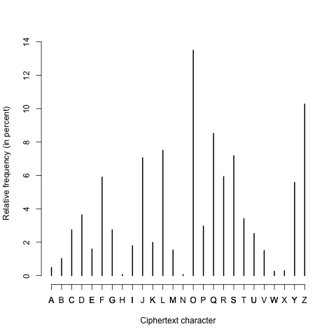
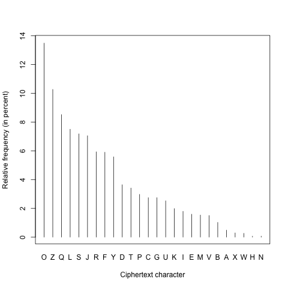

# Homework 5: Cryptography

**Due**: April 5, 2016

  
### Problem 1 (10 points)

The following cipher text is written in a Caesar shift cipher:

    LZW USL AF ZAK ZSL CFGOK S DGL STGML LZSL
  
(a) (5 points) Decrypt the message and write down what it says.

(b) (5 points) What method did you use to decrypt it? Describe why you chose to use that method and how you proceeded with the decryption.

### Problem 2 (20 points)

Using a shift cipher is very easy to break with a brute force attack because there are only 25 different keys for encoding. An alternative is to allow any arbitrary mapping of each letter occurring in the plain text to a different letter in the cipher text. This makes it quite hard to remember which letter maps to which, so it was common to have a keyphrase that produced the key. For example, using the key phrase "JULIUS CAESAR", we need to remove any spaces and duplicate letters, which gives us "JULISCAER" and then reproduce the rest of the remaining letters in the alphabet, in alphabetic order (and starting from the last letter of the key phrase). This produces the following key:

    Plain alphabet:  a b c d e f g h i j k l m n o p q r s t u v w x y z
    Cipher alphabet: J U L I S C A E R T V W X Y Z B D F G H K M N O P Q
  
(a) (8 points) If one wants to use the keyphrase "ALAN MATHISON TURING", what is the key? Give it in the same format as above, with the plain alphabet written on top and the cipher alphabet on the bottom.

(b) (7 points) Encode the message "the codebreakers at bletchley park" using this key.

(c) (5 points) Even though the use of key phrases permits the use of a much greater number of keys than using a shift cipher, it is not secure. What is the major weakness of simple substitution ciphers? Use details of the above message and its encoding as an example.

### Problem 3 (30 points)

The following is a cipher text that was encoded using a monoalphabetic cipher:

> MYOJZYOSQZCFJBGLLJFLTAOZSEDQSZOULPPPFLGTQKOTQJQBOFQDRJPDLFRUQZYORFPDRIYZKQZYSZLL
> AZYOGOQSZLBOFZYOQZDQJZRTLTOQJZYOSQZCFJSMOFOGQUOCKLPZYFOOSZQIOSMYOJZYOPRFSZYQUCSO
> UCKQDDRZSPCODZMLQJUQYQDPGRJCZOSRJZLZYOPDRIYZRZMQSCJTOFOGLJRLCSDVWOZZRSLJOUQJUDOP
> ZZLSKDQSYRJZLZYOSOQSQPODVQMQVPFLGQJVYCGQJYQERZQZRLJZYOFLTAOZSZQIOSQJUZYOOJIRJOSZ
> YQZMOFOQZZQTYOUZLZYOGYQBOSQZRJZYORFMQZOFVWCJAVQFUPLFQDGLSZYQDPQTOJZCFVJLMZYLCIYZ
> YOVQFOEOIRJJRJIZLFOZCFJLJGQFTYZYRJQEDLIKLSZWOPPEOXLSZYOPLCJUOFLPQGQXLJQJUQTLJPRF
> GOUSKQTOTQUOZQJJLCJTOUZYQZYRSKFLWOTZZLEFRJISLGOLPZYOSQZCFJSGRIYZVPOJIRJOSEQTAZLZ
> YOSCFPQTOYQUEOOJSCTTOSSPCDRZRSQJRGKFOSSRBOPOQZLPOJIRJOOFRJIFOGRJRSTOJZLPZYOOPPLF
> ZZYQZDLTQZOUZYOMFOTALPZYOFGSZRZQJRTRJJQSQSPDRIYZUQZQIQBOGFEOXLSSZOQGQFLCIYDLTQZR
> LJZLEOIRJZYOSOQFTYZYOVZYOJCSOUSLJQFZLKRJKLRJZZYOOJIRJOSKFOTRSODLTQZRLJSCJUOFSOQF
> LELZSSRGRDQFZLZYLSOCSOUZLRJBOSZRIQZOZYOZRZQJRTMOFOSOJZULMJZYFLCIYGLFOZYQJGOZFOSP
> OOZLPMQZOFZLTLJPRFGZYOPRJUZYOFOQFOQPOMTQBOQZSRZSOOGSGFEOXLSYQSJLZGQJQIOUZLFOTLBO
> FQJVTLGKDOZOOJIRJOSZYLCIYYOFOTALJSYOYQSOJLCIYKROTOSZLTLEEDOZLIOZYOFZMLTLGKDOZOON
> QGKDOSZYOLFRIRJQDILQDYQUEOOJZLFOTLBOFZYOOJIRJOSPFLGZYOGLSZPQGLCSPDRIYZLPQDDQKLDD
> LMYLSOTFOMEOTQGOZYOPRFSZYCGQJSZLMQDALJQJLZYOFTODOSZRQDELUVECZZRGOSQDZMQZOFQJUZYO
> OPPOTZSLPSGQSYRJIRJZLZYOSOQQZYRIYSKOOUYQBODOPZZYOOJIRJOSEQZZOFOUQJUEFCRSOUQJUZYO
> SOFRQDJCGEOFSLJZYORFTLGKLJOJZSMYRTYMLCDUOJQEDOJQSQZLRUOJZRPVZYOSKOTRPRTFLTAOZPFL
> GMYRTYZYOVTQGOTQJJLZQDMQVSEOFOQUMYOJZYOPCZCFOEOTLGOSZYOKQSZJLJOZYODOSSRZRSZYOGLS
> ZRGKFOSSRBOPOQZLPZYOJOMQJUKLRIJQJZLFRFLJRTPRODULPSKQTOQFTYQOLDLIVSKQTOZFQBODYQSE
> OOJSVJLJVGLCSMRZYZYORUOQLPZYOPCZCFOPLFLBOFQYCJUFOUVOQFSZYOSQZCFJSZYOGSODBOSMOFOR
> JGQJVMQVSLCZLPZYORFZRGOQZGOZFOSZQDDZYOVMOFOZYOSRXOLPQSGQDDLPPRTOECRDURJIQJUOBOJY
> QDPQTOJZCFVDQZOFZYOVFOGQRJZYOGLSZKLMOFPCDFLTAOZSOBOFZLYQBOPDLMJVOZZYOSOUQVSZYOPC
> ZCFOZYQZZYOSQZCFJSFOKFOSOJZOUYQSEOTLGOQJLEWOTZLPSZCUVPLFZYLSOMYLRJBOSZRIQZOZYOKQ
> SZQSZYOYOFLRTSKQTOQIOUFOQGOULPEVSTROJTOPRTZRLJQCZYLFSSRJTOWCDOSBOFJOYQSFOSLDCZOD
> VPQRDOUZLGQZOFRQDRSOOBOFSRJTOZYOTQJTODDQZRLJLPZYOQKLDDLKFLIFQGGORJQSZFLJQCZSYQBO
> EOOJSZCTARJDLMOQFZYLFERZZYOFOQFOKDOJZVLPLZYOFSEOSRUOSGFEOXLSMYLQFOAOOJZLRJBOSZRI
> QZOQJUKFOSOFBOZYQZBQJRSYOUPCZCFORJPLFRJSZQJTOJQSQFODOQSOUYRIYFOSLDCZRLJKRTZCFOSP
> FLGRZSDCJQFFOTLJJRSSQJTOLFERZOFSKQTOTFQPZSYLMRJIZYOBQFRLCSQKLDDLDQJURJISRZOSQSMO
> DDQSSLGOLPZYOFLELZRTTFQPZSOJZZLZYOGLLJRJZYOSEVZYOSLBROZCJRLJQZOQGLPQGQZOCFQSZFLJ
> LGOFSRSQZZOGKZRJIZLDLTQZOZYOQSTOJZSZQIOLPSJLLKVQKLDDLSDCJQFGLUCDOMYRTYRJZOJZRLJQ
> DDVURUJLZQTZCQDDVDQJUQJUMYRTYMQSQEQJULJOURJZLQSCJTRFTDRJILFERZQJUSKCFFOUEVZYODCJ
> QFQGERZRLJSLPTYRJQQSMODDQSEVZYOKFLSKOTZLPBRSRZSEVKFRBQZODVPRJQJTOUFLELZRTSKQTOTF
> QPZCJUOFILLIDOSDCJQFNKFRXOJQSQDQSZVOQFFODOQSOUQULTCGOJZFOHCOSZRJIZYQZQJVJOMBRSRZ
> LFSZLZYOGLLJAOOKZYORFURSZQJTOPFLGZYOQKLDDLDQJURJISRZOSRJLFUOFZLKFLZOTZDCJQFYRSZL
> FRTQFZRPQTZSQSPLFGFEOXLSSOJIRJOSZYOVFOGQRJZYOKFLKOFZVLPJQSQFQRSRJIZYOGPFLGZYOLTO
> QJPDLLFMQSQKQSSRLJKFLWOTZRPZYOVTQJEOFOQSSOGEDOUYORJZOJUSZLKCZZYOGLJKCEDRTURSKDQV
> LJOMRDDKFOSCGQEDVOJUCKQZZYOSGRZYSLJRQJJQZRLJQDQRFQJUSKQTOGCSOCGRJMQSYRJIZLJMRZYZ
> YOLZYOFKOFYQKSILRJIZLZYOGCSOCGLPPDRIYZRJSOQZZDOJOQFMYOFOGFEOXLSDRBOSZYOFOZYOVMRD
> DWLRJZYOUCSZVSKQTOSCRZSSTLFTYOUTFOMTQKSCDOSQJUGLUODFLTAOZSZYQZGQFAQPCZCFOZYQZJOB
> OFHCRZOTQGOZLEO
  
Note that all spaces and punctuation in the original plaintext have been removed. Also, numbers were removed, so there will be a few odd looking phrases where something like "for 1 in 10 individuals" comes out as "for in individuals". (Note: this examples does not come from the text, so it won't be helpful as a clue.)

In this problem, you'll exploit the major weakness of monoalphabetic ciphers and decode this message using frequency analysis. The text is somewhat long. **Don't be intimidated by this – it actually makes the problem easier**. You will only need to write down the decoded plaintext for the first two lines. (But, you get to use the rest of the text as part of cracking the encoding.)

The relative frequency of a character is the number of tokens of that character divided by the total number of character tokens. For example, in ABCADEAFG the relative frequency of A is 3/9 = 1/3 = .3333 = 33.33%. In the ciphertext above, A has a relative frequency of 2.54%. The following is the relative frequency distribution for all the characters in the ciphertext. 

Cipher character | Relative frequency
A | 0.48
B | 1.02
C | 2.74
D | 3.64
E | 1.59
F | 5.9
G | 2.74
H | 0.06
I | 1.79
J | 7.05
K | 1.98
L | 7.5
M | 1.53
N | 0.06
O | 13.49
P | 2.97
Q | 8.52
R | 5.93
S | 7.18
T | 3.41
U | 2.52
V | 1.5
W | 0.26
X | 0.29
Y | 5.58
Z | 10.27

Here is the same information graphically, ordered alphabetically: 

  
  
Here it is ordered by frequency:

  

  
(a) (20 points) Decode the first two lines of the cipher text. Look at the relative frequencies of letters in the English language provided in Wikipedia. Compare the relative frequency distribution given above to the distribution given in Wikipedia, using it to generate hypotheses about which ciphertext characters might correspond to which plaintext characters. Test those hypotheses on small segments of the ciphertext to see if they make sense; then using the process of elimination and some educated guesses based on the words you are starting to see appear, determine the rest of the key and decode the message. Write down the decoded plaintext for the first two lines of the cipher text.

**TIP**: You should put the cipher text into an editor like Microsoft Word or Google Docs and use Find and Replace as you test different guesses. It will be especially helpful if you can replace the capital letters of the cipher with lowercase plain text characters.

If you are able to use Unix, use the 'tr' function like I did in class, e.g. if you think cipher text **Z** is plaintext **g**k and that cipher text **X** is plaintext **e**, you can do the following to see the partial decryption of the string *ETGZNTZX*.

    $ echo "ETGZNTZX" \| tr 'ZX' 'ge'
    ETGgNTge
  
(b) (5 points) Describe the major aspects of the process you went through to decode the message. Which strategies did you use? How did your knowledge of English help in the decoding?

(c) (5 points) Write down the key showing which plaintext character corresponds to which ciphertext character.

(d) (Extra credit, 4 points) The key was generated in a systematic way. How was it done? (This is not easy.)

(e) (Extra credit, 1 point) Can you find the web page that contains the plaintext?

### Problem 4 (20 points)

The following message is encrypted with the Vigenere cipher, using the key phrase "LONGHORNS":

    LDEUIZVZDTYRZOWJVKZBGNLTZASWSKGT
  
(a) (10 points) Decrypt the message and write down what it says.

(b) (10 points) Now, encrypt the message using the key phrase BEVO.

Note: there are tools on the Internet for encoding and decoding with the Vigenere cipher. You are welcome to use them to check your work – but make sure you understand the principle to what is going on (keep in mind that these tools won’t be available during the exam).

### Problem 5 (20 points)

Give two reasons why the Navajo code talkers were so effective for secure communication in WWII and explain one strategy that they had to employ to avoid being "decoded".

You are encouraged to use outside sources for answering this question, including Wikipedia's code talker page. 

